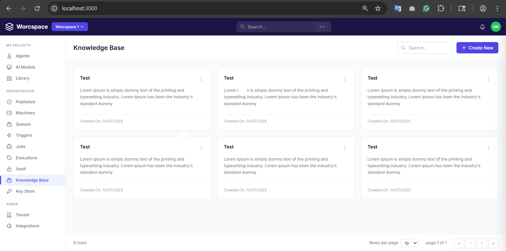
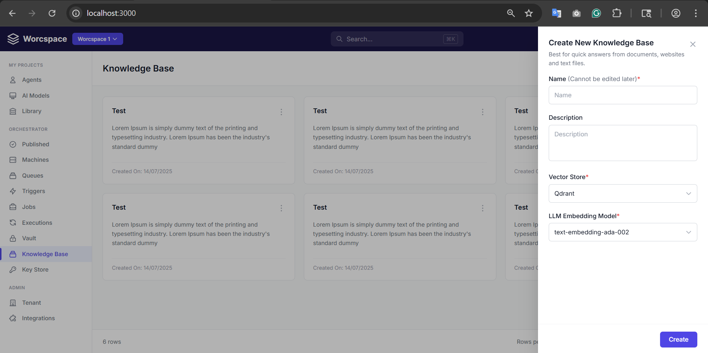
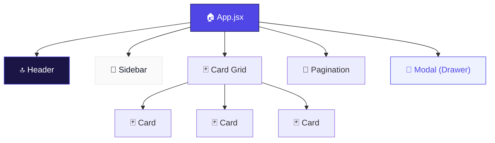

<div align="center">

# 📚 Knowledge Base UI

### A modern AI-powered Knowledge Base management dashboard

`React` · `Tailwind CSS` · `Vite`

<br />

[](https://react.dev)
[](https://vitejs.dev)
[](https://tailwindcss.com)
[](https://nodejs.org)
[](LICENSE)
[](CONTRIBUTING.md)

<br />

[📖 Documentation](#-key-terms--concepts) · [🚀 Quick Start](#-quick-start) · [🧩 Components](#-component-architecture) · [🤝 Contributing](#-contributing)

</div>

<br />

---

<br />

## ✨ Overview

**Knowledge Base UI** is a pixel-perfect, responsive dashboard for managing knowledge base entries in AI orchestration platforms. It enables users to create, browse, and organize knowledge bases that power **RAG (Retrieval-Augmented Generation)** pipelines using **vector stores** and **LLM embedding models**.

> 💡 Designed from Figma mockups with a focus on clean UI patterns, accessibility, and modular React architecture.

<br />

## 📸 Preview

### 📊 Dashboard View



*Responsive card grid with search, sidebar navigation, and pagination*

---

### ➕ Create Panel



*Slide-in drawer with vector store & embedding model configuration*

<br />

## 🎯 Features

<table>
  <tr>
    <td align="center" width="33%">
      <h3>📱</h3>
      <strong>Responsive Grid</strong>
      <br /><br />
      Adaptive 1→2→3 column card layout using CSS Grid with Tailwind breakpoints
    </td>
    <td align="center" width="33%">
      <h3>🗂️</h3>
      <strong>Slide-in Drawer</strong>
      <br /><br />
      Right-edge panel with smooth 300ms CSS transform animation & backdrop overlay
    </td>
    <td align="center" width="33%">
      <h3>📑</h3>
      <strong>Collapsible Sidebar</strong>
      <br /><br />
      Grouped navigation (Projects · Orchestrator · Admin) with mobile hamburger toggle
    </td>
  </tr>
  <tr>
    <td align="center">
      <h3>🔍</h3>
      <strong>Dual Search</strong>
      <br /><br />
      Global navbar search (⌘K) plus contextual page-level search input
    </td>
    <td align="center">
      <h3>⌨️</h3>
      <strong>Accessible</strong>
      <br /><br />
      ARIA roles, keyboard navigation, Escape-to-close, visible focus rings
    </td>
    <td align="center">
      <h3>⚡</h3>
      <strong>Instant HMR</strong>
      <br /><br />
      Vite-powered dev server with sub-second hot module replacement
    </td>
  </tr>
</table>

<br />

---

<br />

## 🚀 Quick Start

```bash
# 1. Clone the repo
git clone https://github.com/your-username/knowledge-base-ui.git
cd knowledge-base-ui

# 2. Install dependencies
npm install

# 3. Start development server
npm run dev
```

Open **http://localhost:5173** — you're in! 🎉

### Other Commands

| Command | Description |
|:---|:---|
| `npm run dev` | Start Vite dev server with Hot Module Replacement |
| `npm run build` | Create optimized production bundle in `dist/` |
| `npm run preview` | Preview the production build locally |
| `npm run serve` | Serve standalone `index.html` via Node.js on port 3000 |

<br />

---

<br />

## 🛠️ Tech Stack

<table>
  <tr>
    <th align="left" width="20%">Technology</th>
    <th align="left" width="15%">Version</th>
    <th align="left">Role & Explanation</th>
  </tr>
  <tr>
    <td><strong>⚛️ React</strong></td>
    <td><code>18.2</code></td>
    <td>
      <strong>Component-based UI library.</strong> React lets you build interfaces from reusable, self-contained pieces called <strong>components</strong>. Each component manages its own state and renders a piece of the UI. React 18 introduces the <code>createRoot</code> API and concurrent rendering capabilities.<br /><br />
      <strong>Hooks used:</strong><br />
      • <code>useState</code> — Manages local state (modal open/close, sidebar toggle)<br />
      • <code>useEffect</code> — Runs side effects (keyboard listeners, scroll lock)<br />
      • <code>useRef</code> — References DOM nodes without re-rendering
    </td>
  </tr>
  <tr>
    <td><strong>⚡ Vite</strong></td>
    <td><code>5.0</code></td>
    <td>
      <strong>Next-generation build tool.</strong> Vite (French: "fast") serves source files over native ES modules during development — no bundling required. This enables near-instant server start and <strong>Hot Module Replacement (HMR)</strong> that updates the browser in milliseconds.<br /><br />
      For production, it uses <strong>Rollup</strong> under the hood for tree-shaking (dead code elimination), code splitting, and minification.
    </td>
  </tr>
  <tr>
    <td><strong>🎨 Tailwind CSS</strong></td>
    <td><code>3.4</code></td>
    <td>
      <strong>Utility-first CSS framework.</strong> Instead of writing custom CSS classes, you compose styles from atomic utility classes directly in your markup:<br /><br />
      <code>className="flex items-center gap-3 px-5 py-2 text-sm font-medium"</code><br /><br />
      <strong>Key features used:</strong><br />
      • <strong>Responsive prefixes</strong> — <code>md:</code>, <code>lg:</code>, <code>xl:</code> apply styles at specific breakpoints<br />
      • <strong>Arbitrary values</strong> — <code>text-[13px]</code>, <code>w-[18px]</code> for one-off sizes via JIT<br />
      • <strong>Opacity modifier</strong> — <code>bg-white/10</code>, <code>bg-black/30</code> for transparent colors<br />
      • <strong>Ring utilities</strong> — <code>focus:ring-2</code> for box-shadow focus indicators
    </td>
  </tr>
  <tr>
    <td><strong>🔧 PostCSS</strong></td>
    <td><code>8.4</code></td>
    <td>
      <strong>CSS transformation pipeline.</strong> Processes the <code>@tailwind</code> directives and adds vendor prefixes via <strong>Autoprefixer</strong> for cross-browser compatibility (e.g., <code>-webkit-</code>, <code>-moz-</code>).
    </td>
  </tr>
  <tr>
    <td><strong>📦 Node.js</strong></td>
    <td><code>18+</code></td>
    <td>
      <strong>JavaScript runtime.</strong> Powers the lightweight static file server (<code>server.js</code>) that serves the standalone HTML version using Node's built-in <code>http</code>, <code>fs</code>, and <code>path</code> modules.
    </td>
  </tr>
</table>

<br />

---

<br />

## 📁 Project Structure

```
knowledge-base-ui/
│
├── 📄 index.html              ← Standalone single-file app (CDN-based React + Tailwind)
├── 📄 package.json            ← Dependencies, scripts, project metadata
├── ⚙️ vite.config.js          ← Vite build configuration (React plugin)
├── 🎨 tailwind.config.js      ← Custom color tokens, fonts, content paths
├── 🔧 postcss.config.js       ← PostCSS pipeline (Tailwind + Autoprefixer)
├── 🖥️ server.js               ← Node.js static file server (port 3000)
│
├── 📸 screenshots/
│   ├── dashboard.png          ← Dashboard view screenshot
│   └── create-panel.png       ← Create panel screenshot
│
└── 📂 src/                    ← Vite React application source
    ├── main.jsx               ← Entry point — mounts React to DOM
    ├── App.jsx                ← Root component — layout + state management
    ├── index.css              ← Global styles (Tailwind directives, resets)
    │
    ├── 🧩 components/
    │   ├── Header.jsx         ← Top navigation bar
    │   ├── Sidebar.jsx        ← Left sidebar navigation
    │   ├── Card.jsx           ← Knowledge base item card
    │   ├── Modal.jsx          ← Slide-in drawer (create form)
    │   └── Pagination.jsx     ← Footer pagination controls
    │
    └── 📊 data/
        └── articles.js        ← Mock knowledge base entries
```

<br />

---

<br />

## 🧩 Component Architecture



### Component Details

<details>
<summary><strong>🔝 Header.jsx — Top Navigation Bar</strong></summary>

<br />

The fixed-position top navbar with a dark purple background. Always visible at the top via `fixed top-0 left-0 right-0 z-50`.

| Element | Description |
|:---|:---|
| **Logo** | SVG layer-stack icon + "Worcspace" brand text |
| **Workspace Selector** | Dropdown button for switching workspaces |
| **Global Search** | Semi-transparent search bar (`bg-white/10`) with ⌘K shortcut badge |
| **Notification Bell** | Bell icon with hover opacity transition |
| **User Avatar** | Green circle with user initials "OK" |

**Key CSS concepts:**
- `fixed` — Removes element from normal flow, positions relative to the viewport
- `z-50` — Sets stacking order to 50 (above sidebar at z-40, below modal at z-90+)
- `bg-white/10` — White background at 10% opacity (creates a frosted/glass effect)

</details>

<details>
<summary><strong>📑 Sidebar.jsx — Left Navigation Panel</strong></summary>

<br />

A vertically scrolling sidebar panel fixed to the left, grouped into three sections:

| Section | Navigation Items |
|:---|:---|
| **MY PROJECTS** | Agents · AI Models · Library |
| **ORCHESTRATOR** | Published · Machines · Queues · Triggers · Jobs · Executions · Vault · **Knowledge Base** *(active)* · Key Store |
| **ADMIN** | Tenant · Integrations |

**Active state indicator:** A 3px-wide indigo bar (`w-[3px] bg-brand rounded-r`) positioned absolutely on the left edge of the active item.

**Mobile behavior:**
- Hidden off-screen via `-translate-x-full`
- Toggled with hamburger button → `translate-x-0`
- Background overlay (`bg-black/30`) captures outside clicks to close

**SVG Icons:** Each nav item uses inline SVG paths from [Heroicons](https://heroicons.com/) — a library of hand-crafted SVG icons by the Tailwind CSS team.

</details>

<details>
<summary><strong>🃏 Card.jsx — Knowledge Base Entry Card</strong></summary>

<br />

Displays a single knowledge base item.

| Element | Description |
|:---|:---|
| **Title** | Bold heading text (`font-semibold text-[15px]`) |
| **Menu Button** | Three-dot vertical ellipsis for context actions |
| **Description** | Body text in secondary color for readability |
| **Footer** | "Created On" date separated by a subtle top border |

**Key CSS:** `flex flex-col justify-between` pushes the footer to the bottom regardless of content height, creating consistent card sizing across the grid.

</details>

<details>
<summary><strong>📝 Modal.jsx — Slide-in Drawer Panel</strong></summary>

<br />

A right-side drawer panel (not a centered modal) for creating new knowledge base entries.

| Form Field | Type | Description |
|:---|:---|:---|
| **Name** | Text input | Required field — cannot be edited after creation |
| **Description** | Textarea | Optional multi-line description (`resize-none`) |
| **Vector Store** | Select dropdown | Choose: Qdrant · Pinecone · Weaviate · Milvus |
| **LLM Embedding Model** | Select dropdown | Choose: text-embedding-ada-002 · 3-small · 3-large |

**Animation & transitions:**
- Panel: `transition-transform duration-300 ease-in-out`
- Open: `translate-x-0` → Closed: `translate-x-full` (slides right off-screen)
- Backdrop: Custom `fadeIn` keyframe animation (0→1 opacity over 200ms)

**Accessibility (ARIA):**
- `role="dialog"` — Tells screen readers this is a dialog window
- `aria-modal="true"` — Indicates content behind is inert/blocked
- `aria-labelledby="drawer-title"` — Associates the dialog with its heading
- `aria-label="Close"` — Describes the X button's purpose
- `Escape` key listener via `useEffect` dismisses the drawer
- `document.body.style.overflow = 'hidden'` — Prevents background scroll

</details>

<details>
<summary><strong>📄 Pagination.jsx — Footer Controls</strong></summary>

<br />

Sticky footer bar with table-style pagination:

| Element | Description |
|:---|:---|
| **Row Count** | Dynamic "N rows" label |
| **Rows Per Page** | `<select>` dropdown: 10 / 25 / 50 |
| **Page Indicator** | "page X of Y" text |
| **Navigation** | « (first) · ‹ (prev) · › (next) · » (last) buttons |

</details>

<details>
<summary><strong>🏠 App.jsx — Root Component</strong></summary>

<br />

The main application shell that composes all other components:

1. **State management** via `useState`:
   - `isModalOpen` — Controls the create drawer visibility
   - `isSidebarOpen` — Controls the mobile sidebar toggle
2. **Layout offset** — `lg:ml-52` adds left margin matching the sidebar width (208px) on large screens
3. **Component composition** — Renders Header → Sidebar → Content (cards + pagination) → Modal

</details>

<br />

---

<br />

## 🎨 Design System

### Color Palette

<table>
  <tr>
    <th>Token</th>
    <th>Hex</th>
    <th>Preview</th>
    <th>Usage</th>
  </tr>
  <tr>
    <td><code>brand</code></td>
    <td><code>#4F46E5</code></td>
    <td></td>
    <td>Primary buttons, active states, focus rings</td>
  </tr>
  <tr>
    <td><code>brandDark</code></td>
    <td><code>#1E1B4B</code></td>
    <td></td>
    <td>Dark accent color</td>
  </tr>
  <tr>
    <td><code>navBg</code></td>
    <td><code>#1a1545</code></td>
    <td></td>
    <td>Top navigation bar background</td>
  </tr>
  <tr>
    <td><code>cardBorder</code></td>
    <td><code>#E5E7EB</code></td>
    <td></td>
    <td>Card borders, dividers</td>
  </tr>
  <tr>
    <td><code>textPrimary</code></td>
    <td><code>#111827</code></td>
    <td></td>
    <td>Headings, primary body text</td>
  </tr>
  <tr>
    <td><code>textSecondary</code></td>
    <td><code>#6B7280</code></td>
    <td></td>
    <td>Descriptions, secondary labels</td>
  </tr>
  <tr>
    <td><code>textMuted</code></td>
    <td><code>#9CA3AF</code></td>
    <td></td>
    <td>Hints, placeholders, disabled text</td>
  </tr>
  <tr>
    <td><code>activeBg</code></td>
    <td><code>#EEF2FF</code></td>
    <td></td>
    <td>Active sidebar item background</td>
  </tr>
  <tr>
    <td><code>activeText</code></td>
    <td><code>#4F46E5</code></td>
    <td></td>
    <td>Active sidebar item text</td>
  </tr>
</table>

### Typography

| Property | Value |
|:---|:---|
| **Font** | [Inter](https://fonts.google.com/specimen/Inter) — optimized for screens with tall x-height |
| **Fallback** | `system-ui, sans-serif` — OS default UI font |
| **Smoothing** | `-webkit-font-smoothing: antialiased` for crisp rendering |

### Responsive Breakpoints

| Prefix | Width | Target |
|:---|:---|:---|
| `sm:` | ≥ 640px | Landscape phones |
| `md:` | ≥ 768px | Tablets |
| `lg:` | ≥ 1024px | Laptops |
| `xl:` | ≥ 1280px | Desktops |

### Z-Index Layers

```
z-100 ─── Modal Drawer Panel (topmost)
z-90  ─── Modal Backdrop
z-50  ─── Top Navbar
z-40  ─── Sidebar
z-30  ─── Mobile Sidebar Overlay
```

<br />

---

<br />

## 📚 Key Terms & Concepts

<details>
<summary><strong>🤖 AI & Machine Learning Terms</strong></summary>

<br />

| Term | Explanation |
|:---|:---|
| **Knowledge Base** | A structured collection of documents, FAQs, and articles that an AI system can query to produce accurate, grounded answers. Each card in this UI represents one knowledge base. |
| **Vector Store** | A specialized database for storing and querying **vector embeddings** — numerical representations of data in high-dimensional space. Enables **semantic search** (searching by meaning, not just keywords). |
| **LLM (Large Language Model)** | An AI model (e.g., GPT-4, Claude) trained on massive text corpora. LLMs can understand context, generate text, and answer questions. Here they generate embeddings and synthesize answers from the knowledge base. |
| **Embedding Model** | A neural network that converts text into fixed-length numerical vectors. Similar texts produce vectors that are close together in vector space, enabling similarity search. |
| **RAG (Retrieval-Augmented Generation)** | An AI architecture that combines **retrieval** (searching a knowledge base via vector similarity) with **generation** (using an LLM to compose a natural-language answer). This UI manages the retrieval data source. |

#### Vector Store Options

| Store | Description |
|:---|:---|
| **Qdrant** | Open-source vector search engine with advanced filtering and payload support |
| **Pinecone** | Fully managed cloud-native vector database as a service |
| **Weaviate** | Open-source vector DB with built-in ML model integration and GraphQL API |
| **Milvus** | Open-source vector database built for billion-scale similarity search |

#### Embedding Model Options

| Model | Description |
|:---|:---|
| **text-embedding-ada-002** | OpenAI's 2nd-gen model — proven balance of cost, speed, and quality |
| **text-embedding-3-small** | OpenAI's newer compact model — better performance at lower cost |
| **text-embedding-3-large** | OpenAI's premium model — highest accuracy for mission-critical retrieval |

</details>

<details>
<summary><strong>⚛️ React Concepts</strong></summary>

<br />

| Term | Explanation |
|:---|:---|
| **JSX** | A syntax extension that lets you write HTML-like markup in JavaScript. Compiled to `React.createElement()` calls by Babel or the Vite React plugin. |
| **Component** | A reusable, self-contained piece of UI. Each `.jsx` file exports one component that accepts **props** and returns JSX. |
| **Props** | Short for "properties" — data passed from a parent component down to a child. E.g., `<Card title="Test" />` passes `"Test"` as the `title` prop. |
| **State** | Data that changes over time within a component. Managed via `useState`, which returns a `[value, setter]` pair. Changing state triggers a re-render. |
| **Hook** | Special `use`-prefixed functions that let function components access React features like state (`useState`), effects (`useEffect`), and refs (`useRef`). |
| **`createRoot`** | React 18's new root API replacing `ReactDOM.render`. Enables concurrent features and is the standard mount point. |
| **`StrictMode`** | A dev-only wrapper that double-invokes lifecycle methods to help catch side-effect bugs early. Has no effect in production builds. |

</details>

<details>
<summary><strong>🔨 Build & Tooling Concepts</strong></summary>

<br />

| Term | Explanation |
|:---|:---|
| **HMR (Hot Module Replacement)** | Updates changed modules in the browser without a full page reload. Preserves component state during edits for a faster dev loop. |
| **Tree-Shaking** | Dead code elimination during production builds. Analyzes `import`/`export` to remove unused code, shrinking bundle size. |
| **ES Modules** | The native JavaScript module system (`import`/`export`). Vite leverages browser-native ESM for instant dev server startup. |
| **Code Splitting** | Splitting the production bundle into smaller chunks that load on demand, improving initial page load time. |
| **Vendor Prefixes** | Browser-specific CSS prefixes (`-webkit-`, `-moz-`) added automatically by Autoprefixer for cross-browser compatibility. |

</details>

<details>
<summary><strong>🎨 CSS & Tailwind Concepts</strong></summary>

<br />

| Term | Explanation |
|:---|:---|
| **Utility-First CSS** | Composing styles from small, single-purpose classes (`flex`, `p-4`, `rounded-lg`) instead of writing custom CSS. Tailwind is the leading framework for this approach. |
| **JIT (Just-in-Time)** | Tailwind's compilation mode that generates CSS on-demand as you use classes. Enables arbitrary values like `text-[13px]` and keeps output tiny. |
| **Responsive Prefixes** | Breakpoint modifiers like `md:grid-cols-2` that apply styles only at specific viewport widths and above (mobile-first). |
| **Opacity Modifier** | Slash syntax like `bg-white/10` that applies opacity to a color — equivalent to `rgba(255,255,255,0.1)`. |
| **Appearance None** | `appearance-none` removes browser default styling (e.g., native `<select>` arrows) so custom styling can be applied. |
| **Focus Ring** | `focus:ring-2 focus:ring-brand/20` creates a box-shadow-based ring on focus that doesn't affect layout, unlike `outline`. |
| **z-index** | Controls vertical stacking order of overlapping elements. Higher values appear on top. |

</details>

<br />

---

<br />

## 🤝 Contributing

We welcome contributions! Here's how to get started:

```bash
# 1. Fork the repo, then clone your fork
git clone https://github.com/YOUR-USERNAME/knowledge-base-ui.git

# 2. Create a feature branch
git checkout -b feature/amazing-feature

# 3. Make your changes and commit
git commit -m "feat: add amazing feature"

# 4. Push and open a pull request
git push origin feature/amazing-feature
```

<br />

## 📄 License

This project is licensed under the **MIT License** — see [LICENSE](LICENSE) for details.

<br />

---

<div align="center">

  **Built with ❤️ using React, Tailwind CSS, and Vite**

  ⭐ Star this repo if you found it helpful!

</div>
